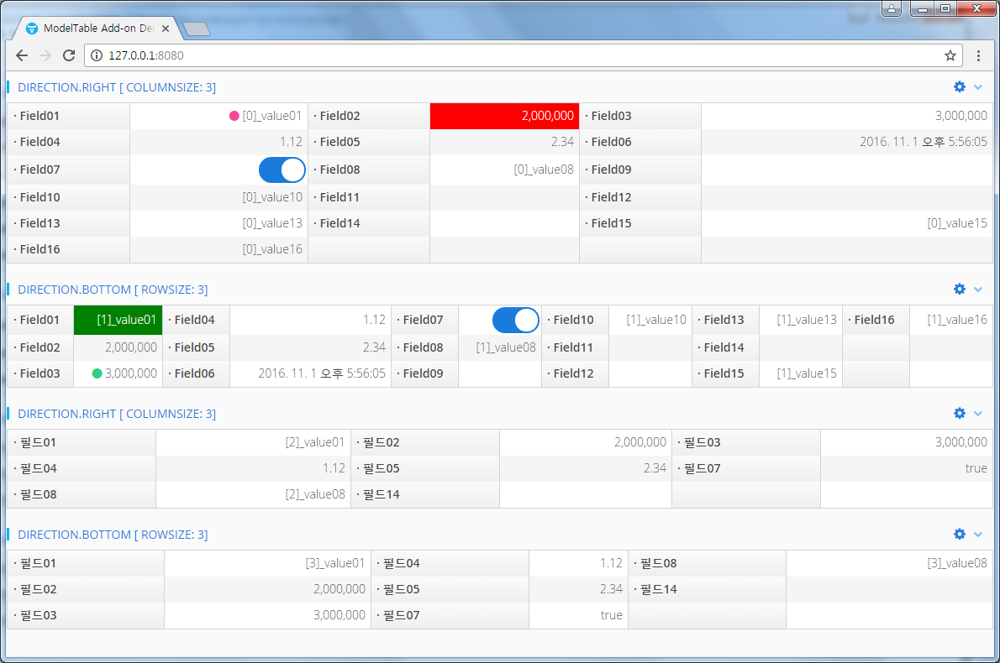

=  ModelTable Add-on for Vaadin

ModelTable is a UI component add-on for Vaadin.

- 0.1.0 -> Vaadin 7.x
- 8.0.7 -> Vaadin Compatibility Server 8.0.6 and newer

== ModelTable Maven

[source,xml,indent=0]
----
<dependency>
	<groupId>com.vaadin.addon</groupId>
	<artifactId>modeltable</artifactId>
	<version>${project.version}</version>
</dependency>

<repository>
   <id>vaadin-addons</id>
   <url>http://maven.vaadin.com/vaadin-addons</url>
</repository>
----

== ModelTable Example Code

[source,java,indent=0]
----
public class Item implements Serializable {
    private String field01;
    //...getter, setter
}

Item item = //...;

ModelTable<Item> modelTable = new ModelTable<>(Item.class);
modelTable.setTitleCaption("Direction.RIGHT [ ColumnSize: " + 3 + "]");
modelTable.setItemDirection(ModelTable.Direction.RIGHT, 3);
modelTable.setItem(item);

modelTable.addMenuItem("Edit", new MenuBar.Command() {
  //...
});
----

## Building and running demo

Linux/Mac

[source,groovy,indent=0]
----
sh mvnw clean install
sh mvnw -pl modeltable-demo spring-boot:run
----

Windows

[source,groovy,indent=0]
----
mvnw.cmd clean install
mvnw.cmd -pl modeltable-demo spring-boot:run
----

Demo Server : http://127.0.0.1:8080

== Building from source

requires Java SE 1.8+

requires Maven 3.3.9+

requires Tomcat 8.0.36+

requires Vaadin Compatibility ** 8.0.6+

== License & Author

Add-on is distributed under Apache License 2.0. For license terms, see LICENSE.txt.

